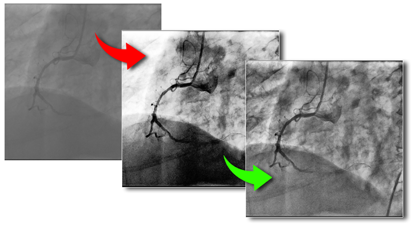

# Willowbend DICOM
A dialog-based DICOM-to-video converter.

***Chuan Yang*** (<yangc@sj-hospital.org>)

[](https://github.com/YangChuan80/WillowbendDICOM)
[](LICENSE)
[](https://github.com/YangChuan80/WillowbendDICOM/raw/master/Installer/WillowbendDICOM_Installer.exe?raw=true)
[](README.md)
[](README.md)
[](https://github.com/YangChuan80)

## Introduction
**DICOM (Digital Imaging and Communications in Medicine)** is a standard for handling, storing, printing, and transmitting information in medical imaging. DICOM files can be exchanged between two entities that are capable of receiving image and patient data in DICOM format by following network communications protocol. DICOM has been widely adopted by hospitals and is making inroads in smaller applications like dentists' and doctors' offices.

**Willowbend DICOM** is a dialog-based application performing the conversion from DICOM format to video format (avi) in order to meet the needs and requirements for universal computer systems (PC, Mac, Linux, etc.). So the ordinary users of such systems can use the converted file to present, communicate and store the universal files. 

Medical imaging related staffs (including Interventional Cardiologists, Physicians of Peripheral Intervention, Neurointerventional Physicians, Medical Imaging Physicians and Radiological Technicians) can use it in medical conferences, educations and remote consultants of clinical medicine, and they will feel free to use universal video formats in the slide presentations in medical courses and case reports. 

Furthermore, besides efficiently converting a file from DICOM to AVI format, Willowbend DICOM can implement **auto grey-scale optimization** and customization for every frame in a DICOM before conversion, and it's able to extract patient's information rapidly from the DICOM files. 
[](README.md)

## Installation from Binaries
- Download **[WillowbendDICOM_Installer.exe](https://github.com/YangChuan80/WillowbendDICOM/raw/master/Installer/WillowbendDICOM_Installer.exe?raw=true)** file from **[here](https://github.com/YangChuan80/WillowbendDICOM/raw/master/Installer/WillowbendDICOM_Installer.exe?raw=true)**, which is a NSIS installation file only used in Windows platform. 
- After downloading, you can install it directly. When finished, a folder with the same name have been made. Enter the folder WillowbendDICOM, run the **WillowbendDICOM.EXE** to go!
- This option is for ordinary users, who are not required to possess any knowledge of Python programming language or to have Python interpreter configured on their computers.
- Willowbend DICOM can currently be installed on Windows 7 or later platform only.

## Installation from Source
This option is only adopted by Python specialist. There are several dependencies necessarily preinstalled in your Python interpreter:

- **SimpleITK**
```
 conda install --channel https://conda.anaconda.org/SimpleITK SimpleITK
 ```

- **Pydicom** 1.0
 - Download pydicom source from [https://github.com/darcymason/pydicom](https://github.com/darcymason/pydicom)

- **OpenCV**
 - Download the wheel file from [https://scivision.co/install-opencv-3-0-x-for-python-on-windows/](https://scivision.co/install-opencv-3-0-x-for-python-on-windows/)

After you complete the WillowbendDICOM.py file download, run it:
```
python WillowbendDICOM.py
```
Python interpreter have to be Python 3.4 or later.

- **Setuptools & Pyinstaler**
 - If you'd like to use **PyInstaller**, you should downgrade your **setuptools** module to **19.2**.

To perform frozen binary, do this:
```
pyinstaller WillowbendDICOM.py -w
```

## Instructions
- Click **Browse** button to choose the DICOM file. 
- Load this chosen file. Don't forget to press **Load** button. When file successfully loaded, a information dialog will pop up to notice you. 
- Click **Convert** button on the right to convert the currently loaded DICOM file to AVI file. During this session, you will be asked to specify the location you're going to output to. Next you are required to select the VIDEO COMPRESSION options, which the **"Full Frames (Uncompressed)"** is recommended. Click **OK**. You'll wait for about a second, and your AVI file is ready! Congratulations!
- Optionally, you can customize the value of the **Clip Limit** if you're not satisfied with your converted AVI file with the default value of 3.0. The higher value means the more contrast effect in the video file you'll get. 

## License
The MIT License (MIT)

Copyright (c) 2016 Chuan Yang

Permission is hereby granted, free of charge, to any person obtaining a copy
of this software and associated documentation files (the "Software"), to deal
in the Software without restriction, including without limitation the rights
to use, copy, modify, merge, publish, distribute, sublicense, and/or sell
copies of the Software, and to permit persons to whom the Software is
furnished to do so, subject to the following conditions:

The above copyright notice and this permission notice shall be included in all
copies or substantial portions of the Software.

THE SOFTWARE IS PROVIDED "AS IS", WITHOUT WARRANTY OF ANY KIND, EXPRESS OR
IMPLIED, INCLUDING BUT NOT LIMITED TO THE WARRANTIES OF MERCHANTABILITY,
FITNESS FOR A PARTICULAR PURPOSE AND NONINFRINGEMENT. IN NO EVENT SHALL THE
AUTHORS OR COPYRIGHT HOLDERS BE LIABLE FOR ANY CLAIM, DAMAGES OR OTHER
LIABILITY, WHETHER IN AN ACTION OF CONTRACT, TORT OR OTHERWISE, ARISING FROM,
OUT OF OR IN CONNECTION WITH THE SOFTWARE OR THE USE OR OTHER DEALINGS IN THE
SOFTWARE.

## Contributor List
- [@wenzhexue](http://github.com/wenzhexue) (**Wenzhe Xue**, Ph.D., Mayo Clinic) 
